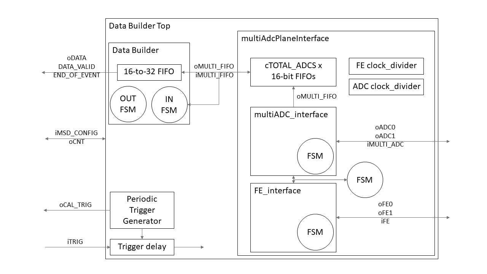
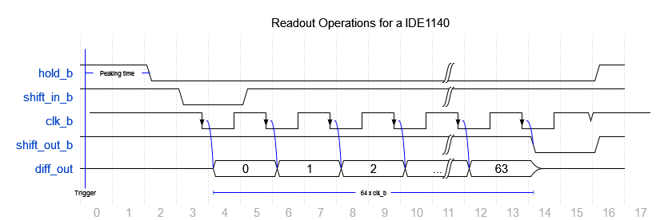
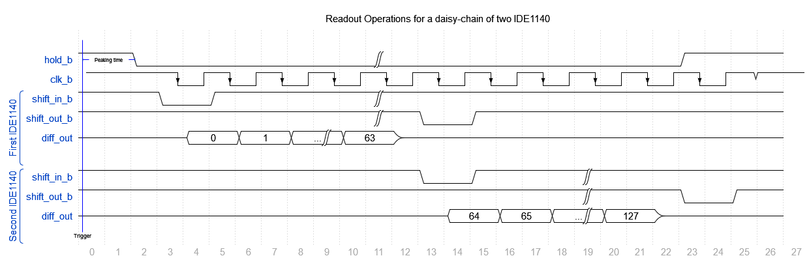
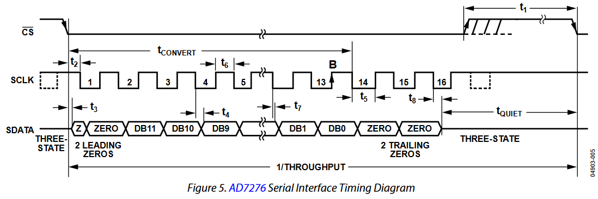

This repository contains the FPGA gateware to readout the microstrip detector of the FOOT experiment. It is based on the Terasic DE10-Nano board, which embeds an Intel Cyclone V SoC (FPGA+HPS). This should limit the use with Intel FPGA only for specific basic elements, e.g. FIFOs.

Front-Ends and ADCs models:
- FE: IDEAS IDE1140, 64-channel silicon-strip readout with analog mux output
- ADC: Analog Devices [AD7276](https://www.analog.com/media/en/technical-documentation/data-sheets/ad7276_7277_7278.pdf), 3-Msps 12-Bit ADC with serial digital readout

# Architecture
The gateware is organized in packages to group parameters, types declarations, and components declarations. In particular, there are two packages:

- [FOOTpackage](./FOOTpackage.vhd): it contains configuration parameters, types, and modules declaration.
- [basic_package](./basic_functions/basic_package.vhd): it contains basic functions and tools.

- [Data_Builder_Top](./Data_Builder_Top.vhd): wrapper that instantiates:
    - *Data_Builder*
    - *multiAdcPlaneInterface*
    - Busy stretch
    - Trigger-2-Hold delay
    - Internal periodic trigger
- [multiAdcPlaneInterface](./multiAdcPlaneInterface.vhd): interface to a X-Y plane. It instantiates and synchronizes *multiADC_interface* and *FE_interface*, together with one FIFO for each ADC.
- [FE_interface](./FE_interface.vhd): interface to the IDEAS IDE1140 Front-Ends.
- [multiADC_interface](./multiADC_interface.vhd): interface to the AD7276 ADCs. Samples each incoming serial signals in a 16-bit shift-register.
- [Data_Builder](./Data_Builder.vhd): priority encoder that collects the ADC FIFOs data into a collector FIFO, passing from 16-bit to 32-bit words. It also implements the output interface to the FOOT DAQ.
- [basic_functions](./basic_functions): folder containing basic functions and tools (counters, shift-registers, ...) that are used in the other modules and are declared in the **basic_package**

---
## FE_interface Timing Diagram
The following figures show the operations to readout a single IDE1140 and a daisy-chain of two IDE1140s. **hold_b** and **clk_b** are send in parallel to all the devices.

---
## multiADC_interface Timing Diagram
The following figure shows the operations to readout a AD7276 ADC. **CS** and **SCLK** are sent in parallel to all of the ADCs.

